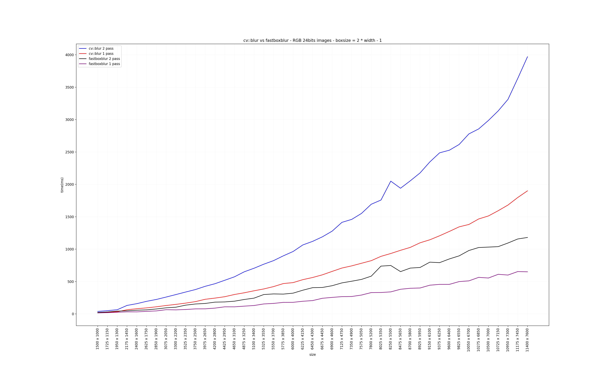

  

# Fast Box Blur - reflection padding

  

  

Header only C++ implementation of a Fast Box Blur in linear time. It's designed to be a full portable, light and faster replacement of `cv::blur` , thus is accurate on image boundaries, emulating a reflection (mirrored) padding without increasing the memory for it.

The main code is based on [FastGaussianBlur](https://github.com/bfraboni/FastGaussianBlur) of @bfraboni and on a blog post by Ivan Kutskir: [blog](http://blog.ivank.net/fastest-gaussian-blur.html). Which refers to a presentation by Wojciech Jarosz: [slides](http://elynxsdk.free.fr/ext-docs/Blur/Fast_box_blur.pdf). The code uses STB_IMAGE and STB_IMAGE_WRITE by stb for image manipulation: [stb github](https://github.com/nothings/stb).

  

  

## Algorithm

  

  
  

A 2D box blur is a separable convolution, hence it is most of the time performed using first an horizontal 1D box blur pass and then a vertical 1D box blur pass. Usually the process of N box blur passes should alternate between these horizontal and vertical passes.

  

However thanks to box blur properties the horizontal and vertical passes can be performed in any order without changing the result.

  

Hence for performance purposes I came up with the following algorithm:

  

1. apply N times horizontal box blur (horizontal passes)

  

2. flip the image buffer (transposition)

  

3. apply N times horizontal box blur (vertical passes)

  

4. flip the image buffer (transposition)

  

  

Steps 1. and 3. are performed with the `horizontal_blur` function, which is a fast 1D box blur pass with a sliding accumulator.

  

Steps 2. and 4. are performed with the `flip_block` function, which is a fast image buffer transposition, processed per block such that it better preserves cache coherency.

  

  

**Note:** This is the main difference with @bfraboni repository. The fast box blur algorithm is accurate on image boundaries, it emulates a reflection (mirrored) padding therefore radius has to be < of width in order to read correctly inside the image buffer, I set a maximum.

  

Example of maximum radius

kernel = 9, radius = 4, width(or height) = 5

e d c b | a b c d e | d c b a

The reflection padding is inside the image buffer!

 ### WIP - Experimental
 
If defined `DOUBLE_ACCUMULATOR` an alternative function is available 
```c++
 template <typename  T, int  C> 
 void  horizontal_blur_kernel_reflect_double(const  T  *in, T  *out, const  int  w, const  int  h, const  int  ksize)
```
[@TJCoding](https://github.com/TJCoding) original idea was to avoid the re-iteration of the function for each pass doing 2 ( or ideally N ) accumulations at once.  

This has been achieved using:
1) A "rough and easy" circular buffer implementation, that stores the 1st pass output sums in a deque
2) A Lookup table used to get the correct index at bounds. 

Both implementations have their limits, the first is unefficient, popping and pushing at every iteration, the latter might be good but the modulo operator with `% lut.size()` slow down the improvement, a possible solution might be to create a bigger lookup table and avoid the modulo at all but the memory usage will increase.
So in conclusion it's slower than the original algorithm but I left it for documentation purposes, maybe we can optimize further or have new ideas, I'm open to it.
  
  
  

For further details please refer to:

  

- http://blog.ivank.net/fastest-gaussian-blur.html

  

- https://www.peterkovesi.com/papers/FastGaussianSmoothing.pdf

  

  

## Implementation

  

  

The implementation is defined in the `fast_box_blur.h` header that contains the fastest templated cache coherent version I could make.

  

The main exposed function is defined as:

  

```c++

  

template<typename  T>

void  fastboxblur(T  *  in, const  int  w, const  int  h, const  int  channels, const  int  ksize, const  int  passes = 1);

  

```

  

where the arguments are:

  

-  `in` is a reference to the source buffer ptr, inplace transformed

  

-  `w` is the image width,

  

-  `h` is the image height,

  

-  `channels` is the image number of channels,

  

-  `ksize` is the desired box car blur,

  

-  `passes` is the number of box car blur passes to perform.

  

  

  

A SIMD vectorized or a GPU version of this algorithm could be significantly faster (but may be painful for the developper for arbitrary channels number / data sizes).

  
  

  
  

  

## Usage

  

  

Run the program with the following command:

  

  

`./fastboxblur <input_filename> <output_filename> <ksize> <passes = 1>`

  

  

- input_image_filename should be any of [.jpg, .png, .bmp, .tga, .psd, .gif, .hdr, .pic, .pnm].

  

- output_image_filename should be any of [.png, .jpg, .bmp] (unknown extensions will be saved as .png by default).

  

- ksize is the desired box car blur.

  

- passes is an optional argument that controls the number of box blur passes (should be positive). Default is 1.

  

  

## Performance

  

The algorithm is designed to be a portable, easy, and faster replacement of `cv::blur` , using an i7-10750H, it's around 2x - 3x time faster.

Benchmark with 45 images 3 channels from 1500 x 1000 px to 11400 x 7600 px, box car size = (2 * width - 1)

  



  

  

## Acknowledgments

  

  

Special thanks to @bfraboni for our insightful discussions and his main repository [Fast Gaussian Blur](https://github.com/bfraboni/FastGaussianBlur).

  

  

## Licence

  

  

You may use, distribute and modify this code under the terms of the MIT license. For further details please refer to : https://mit-license.org/

  

  

## References

  

  
  

- [Fast O(1) bilateral filtering using trigonometric range kernels](http://bigwww.epfl.ch/chaudhury/Fast%20bilateral%20filtering.pdf)

  
  

- [Filtering by repeated integration](http://citeseerx.ist.psu.edu/viewdoc/summary?doi=10.1.1.72.4795)

  

- [Fast Filter Spreading and its Applications](https://www2.eecs.berkeley.edu/Pubs/TechRpts/2009/EECS-2009-54.pdf)

  
  

- [Fast image convolutions](http://elynxsdk.free.fr/ext-docs/Blur/Fast_box_blur.pdf)
